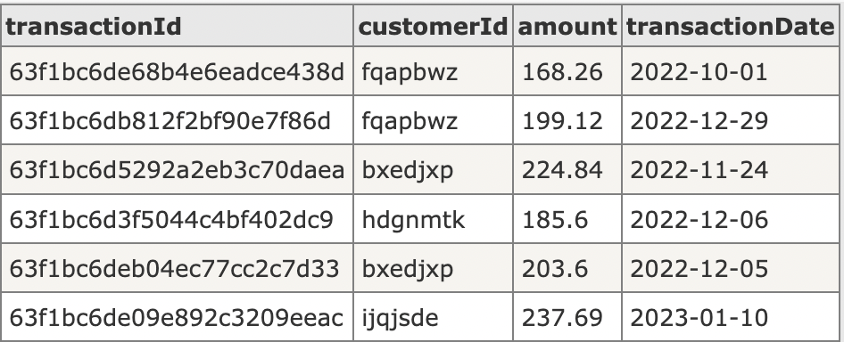
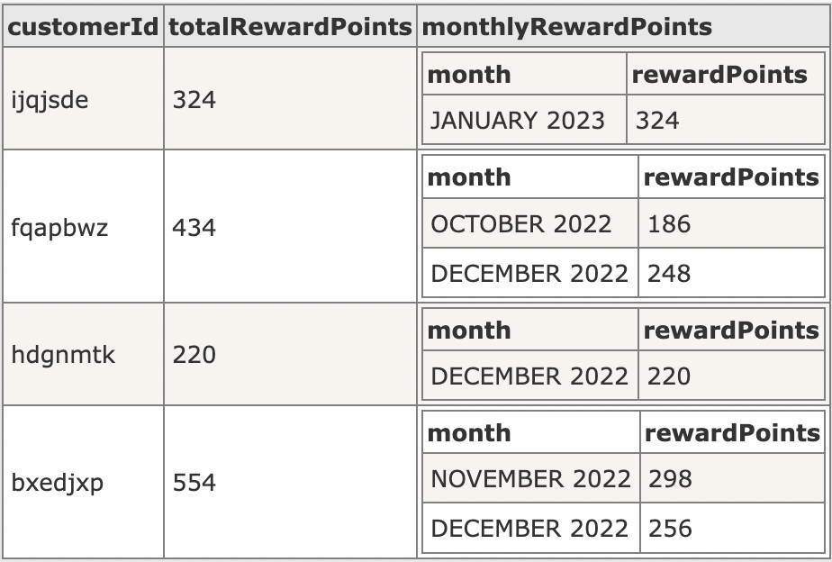

# **Awarding-Service**

# REST API

The REST API to the given probelm is described below.

## Health Check

### Request

`GET /actuator/health`

    curl -i -H GET 'localhost:8080/actuator/health'

### Response

    
    
    HTTP/1.1 200 
    Content-Type: application/vnd.spring-boot.actuator.v3+json
    Transfer-Encoding: chunked
    Date: Mon, 20 Feb 2023 03:13:36 GMT

    {"status":"UP"}

## Calculating rewardpoints for given transactions

### Request

`POST /api/v1/transactions/`

    curl -i  -H 'Content-Type: application/json'  -H POST  'localhost:8080/api/v1/transactions' -d @/Users/sadineni/IdeaProjects/Awarding-Service/src/test/resources/transactions.json

    Sample dataset files links
>[Sample data passed in above curl command](src/test/resources/transactions.json)

>[Generated dummy dataset](src/test/resources/dataset.json.json)

    
    Dummy data can be generated in this 
> [website using below payload](https://json-generator.com/)

    [
        '{{repeat(5, 600)}}',
        {
            transactionId: '{{objectId()}}',
            customerId: '{{random("hdgnmtk", "ijqjsde", "bxedjxp", "fqapbwz", "yxcofag", "tswlvtv", "fcwsfwx", "cphbknw")}}',
            amount: '{{floating(0, 250, 2)}}',transactionDate: '{{date(new Date(2022, 9, 1), new Date(2022, 11, 31), "YYYY-MM-dd")}}'
        }
    ]

    Sample dataset visualization
> 

### Response

    HTTP/1.1 200 
    Content-Type: application/json
    Transfer-Encoding: chunked
    Date: Mon, 20 Feb 2023 04:03:47 GMT

    [
        {
            "customerId" : "ijqjsde",
            "monthlyRewardPoints" : [
                {
                    "month" : "JANUARY 2023",
                    "rewardPoints" : 324
                }
            ],
            "totalRewardPoints" : 324
        },
        {
            "customerId" : "fqapbwz",
            "monthlyRewardPoints" : [
                {
                    "month" : "SEPTEMBER 2022",
                    "rewardPoints" : 186
                },
                {
                    "month" : "DECEMBER 2022",
                    "rewardPoints" : 248
                }
            ],
            "totalRewardPoints" : 434
        },
        {
            "customerId" : "hdgnmtk",
            "monthlyRewardPoints" : [
                {
                    "month" : "DECEMBER 2022",
                    "rewardPoints" : 220
                }
            ],
            "totalRewardPoints" : 220
        },
        {
            "customerId" : "bxedjxp",
            "monthlyRewardPoints" : [
                {
                    "month" : "NOVEMBER 2022",
                    "rewardPoints" : 298
                },
                {
                    "month" : "DECEMBER 2022",
                    "rewardPoints" : 256
                }
            ],
            "totalRewardPoints" : 554
        }
    ]

    Response visualization
>

